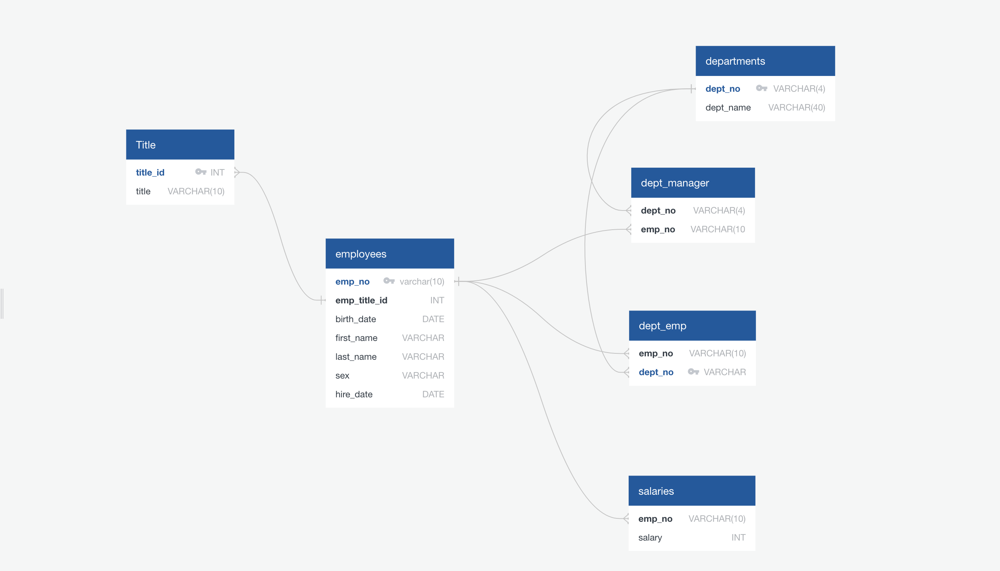

# sql-challenge

## Background

As a new data engineer at Pewlett Hackard (a fictional company). The first major task is to do a research project about people whom the company employed during the 1980s and 1990s. 
All that remains of the employee database from that period are six CSV files. 

## STEPS 

1. Design the tables to hold the data from the CSV files.
2. import the CSV files into a SQL database, and then answer questions about the data.
3. Perform data modeling, data engineering, and data analysis.

## Data Modeling 
ERD by using Quich Database based on the CSVs

## Data Engineering

Use the provided information to create a table schema for each of the six CSV files.
 Be sure to do the following: 
 - Specify the data types, primary keys, foreign keys, and other constraints.
 - For the primary keys, verify that the column is unique.   
 - Import each CSV file into its corresponding SQL table.

GO to EmployeeSQL folder and then click PH_Queries.sql

## Data Analysis 
 1. List the employee number, last name, first name, sex, and salary of each employee.

 2. List the first name, last name, and hire date for the employees who were hired in 1986.

 3. List the manager of each department along with their department number, department name, employee number, last name, and first name.
 4. List the department number for each employee along with that employee’s employee number, last name, first name, and department name.
 5. List first name, last name, and sex of each employee whose first name is Hercules and whose last name begins with the letter B.
 6. List each employee in the Sales department, including their employee number, last name, and first name.

 7. List each employee in the Sales and Development departments, including their employee number, last name, first name, and department name.
 8. List the frequency counts, in descending order, of all the employee last names (that is, how many employees share each last name).